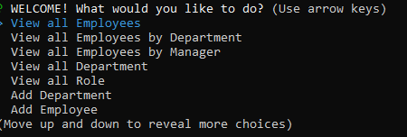

# Employee-tracker

This is a Employee tracker. A command-line application that allows user to manage employees. Users can add departments, roles and employees, view, update and delete departments, roles, employees.
I used MySql, Node.js, JAvascript, node modules and inquirer to build this app. 

GitHub Link: "https://github.com/ezeume/Employee-tracker"
